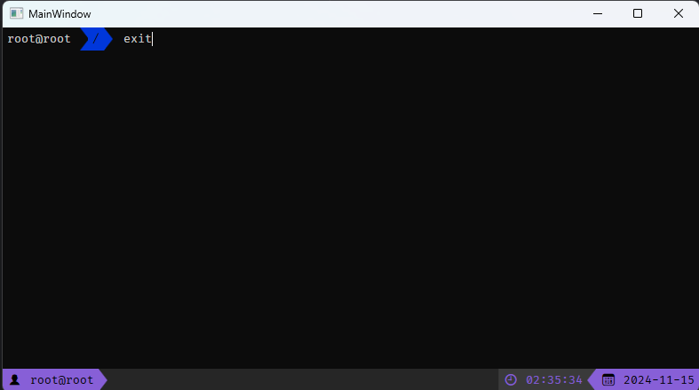
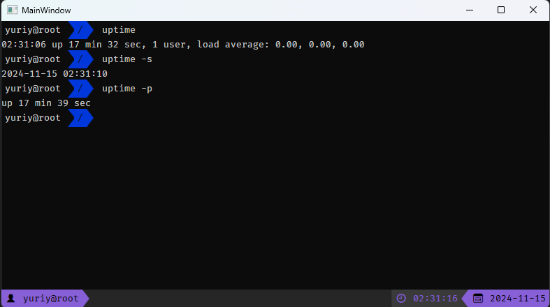
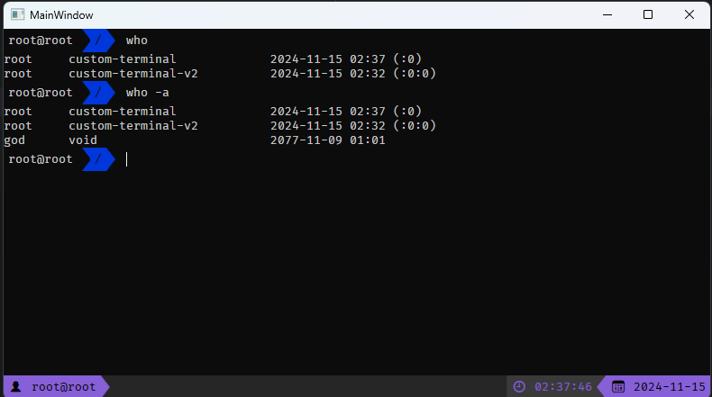
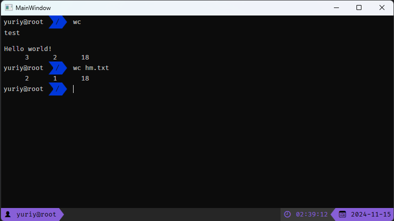
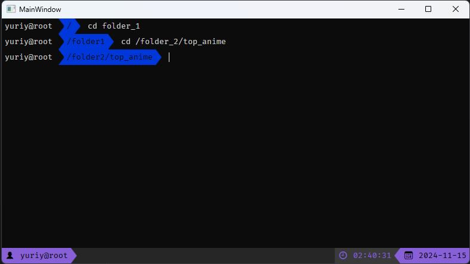
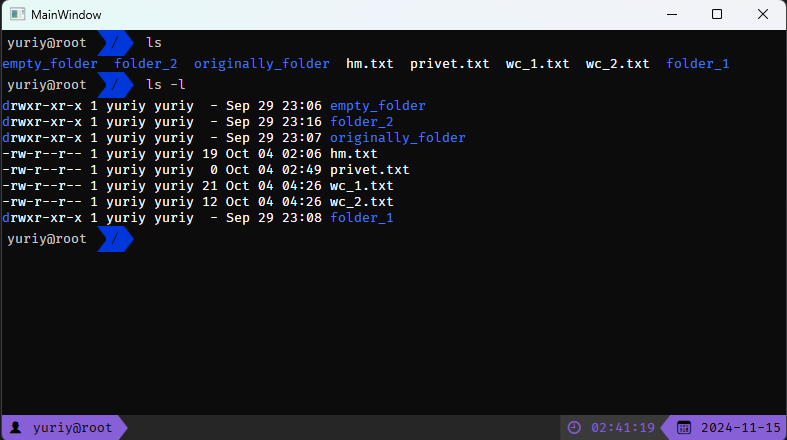

### Общее описание работы
Требуется разработать эмулятор для языка оболочки ОС, поддерживающий следующие команды:
1. ls - Вывод каталогов и файлов для текущего каталога
2. cd - Сменить директорию
3. exit - Выход
4. wc - Вывод информации о файле или тексте
5. uptime - Время работы эмулятора
6. who - Информация о пользователях

Эмулятор должен работать в режиме GUI. 
Конфигурационный файл имеет формат расширения ini


### Используемые модули и язык программирования
Использую язык программирования C# версии net6.0-windows<br>
Для создания GUI использую шаблон проекта WPF<br>
Для создания тестов использую тестирующую систему xUnit<br>
Распаковка архива во время выполнения программы не проводилась.<br>
<br>
В качестве пакетов, импортируемых в программу, использую:
1. Mono.Options - для парса параметров при запуске.
<br>


### Описание команд, функционирование программы
Был создан архив, имитирующий файловую систему, включающую в себя картинки, текстовые файлы и папки.<br>
В бесконечном цикле, прерываемой командой "exit", обрабатывается ввод пользователя.<br>
Если ввод пользователя может быть интерпретирован как одна из шести команд, происходит её обработка.<br>
В случае, если команда не была распознана, выводится сообщение об ошибке.<br>
Команды uptime, who, ls могу принимать дополнительные аргументы такие как:<br>
1. uptime: --since(-s), --pretty(-p)
2. who: --all(-a)
3. ls: --long(-l)
4. 
Команды cd, ls, (иногда)wc могут принимать аргументы в виде пути к файлу или директории.

Принадлежность к абсолютному пути сигнализирует первый символ "/".

### Конфигурационный файл
Конфигурационный файл имеет формат .ini и содержит в себе стартовые команды:
```
ls
who
cd folder1
uptime
ls
```

### При запуске программы необходимо указать:
1. Путь к архиву с файловой системой
2. Путь к стартовому файлу (необязательно)
3. Имя пользователя

_Пример запуска программы:_
```
.\LabConfig.exe -u test -p archive.zip -s start_script.ini
```

### Описание функций
Команды, которые может использовать пользователь:
* exit - завершение работы программы
  - 
* uptime - Время работы эмулятора
   - uptime
   - uptime --since(-s)
   - uptime --pretty(-p)

* who - Информация о пользователях
  - who
  - who --all(-a)

* wc - Вывод информации о файле или тексте
  - wc [text]
  - wc [path]

* cd - Сменить директорию
  - cd [path]

* ls - Вывод каталогов и файлов для текущего каталога
  - ls
  - ls --long(-l)


Все функции также обрабатывают случаи, когда запрос не был выполнен, и с целью максимальной схожести выводят соответствующие сообщения о невыполнения операции, и причину.
### Тесты
Тестирование было выполнено в отельном проекте с использованием системы тестирования xUnit. На каждую функцию представлено минимум три теста.<br>
<br>
_Все они пройдены успешно._

### Url репозитория
[Домашнее задание размещено на github](https://github.com/Stranik2504/LabConfig)
