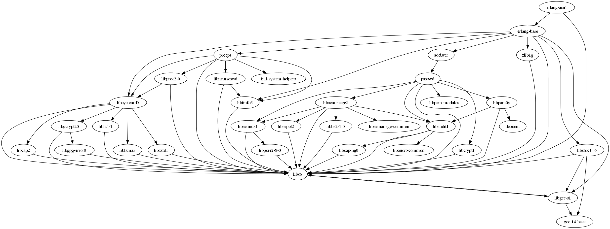

### Общее описание работы
Разработать инструмент командной строки для визуализации графа зависимостей, включая транзитивные зависимости

### Используемые модули и язык программирования
Использую язык программирования C# версии net8.0<br>
<br>
В качестве пакетов, импортируемых в программу, использую:
1. HtmlAgilityPack - для парсинга html страниц
2. Mono.Options - для работы с аргументами командной строки
3. SixLabors.ImageSharp - для работы с изображениями (визуализация графа зависимостей в консоли)

### При запуске программы необходимо указать:
1. Путь к программе для формирования графов
2. Имя пакета, зависимости которого необходимо отобразить
3. Максимальную глубину вложенности зависимостей
4. URL-адрес репозитория

### Пример запуска программы:
```
.\GraphDependencies.exe -p Graphviz-12.2.0-win64\bin\dot.exe -n erlang-asn1 -d -1 -u http://archive.ubuntu.com/ubuntu/ubuntu/dists/noble/main/
```
_И результат запуска примера:_
<br>
<br>
_Текстовой вид зависимостей:_
```
digraph {
	erlang_asn1 [label="erlang-asn1"];
	erlang_base [label="erlang-base"];
	erlang_asn1 -> erlang_base;
	erlang_base [label="erlang-base"];
	procps [label="procps"];
	erlang_base -> procps;
	procps [label="procps"];
	libc6 [label="libc6"];
	procps -> libc6;
	libc6 [label="libc6"];
	libgcc_s1 [label="libgcc-s1"];
	libc6 -> libgcc_s1;
	libgcc_s1 [label="libgcc-s1"];
	gcc_14_base [label="gcc-14-base"];
	libgcc_s1 -> gcc_14_base;
	gcc_14_base [label="gcc-14-base"];
	libc6 [label="libc6"];
	libgcc_s1 -> libc6;
	libncursesw6 [label="libncursesw6"];
	procps -> libncursesw6;
	libncursesw6 [label="libncursesw6"];
	libtinfo6 [label="libtinfo6"];
	libncursesw6 -> libtinfo6;
	libtinfo6 [label="libtinfo6"];
	libc6 [label="libc6"];
	libtinfo6 -> libc6;
	libc6 [label="libc6"];
	libncursesw6 -> libc6;
	libproc2_0 [label="libproc2-0"];
	procps -> libproc2_0;
	libproc2_0 [label="libproc2-0"];
	libc6 [label="libc6"];
	libproc2_0 -> libc6;
	libsystemd0 [label="libsystemd0"];
	libproc2_0 -> libsystemd0;
	libsystemd0 [label="libsystemd0"];
	libc6 [label="libc6"];
	libsystemd0 -> libc6;
	libcap2 [label="libcap2"];
	libsystemd0 -> libcap2;
	libcap2 [label="libcap2"];
	libc6 [label="libc6"];
	libcap2 -> libc6;
	libgcrypt20 [label="libgcrypt20"];
	libsystemd0 -> libgcrypt20;
	libgcrypt20 [label="libgcrypt20"];
	libc6 [label="libc6"];
	libgcrypt20 -> libc6;
	libgpg_error0 [label="libgpg-error0"];
	libgcrypt20 -> libgpg_error0;
	libgpg_error0 [label="libgpg-error0"];
	libc6 [label="libc6"];
	libgpg_error0 -> libc6;
	liblz4_1 [label="liblz4-1"];
	libsystemd0 -> liblz4_1;
	liblz4_1 [label="liblz4-1"];
	libc6 [label="libc6"];
	liblz4_1 -> libc6;
	liblzma5 [label="liblzma5"];
	libsystemd0 -> liblzma5;
	liblzma5 [label="liblzma5"];
	libc6 [label="libc6"];
	liblzma5 -> libc6;
	libzstd1 [label="libzstd1"];
	libsystemd0 -> libzstd1;
	libzstd1 [label="libzstd1"];
	libc6 [label="libc6"];
	libzstd1 -> libc6;
	libsystemd0 [label="libsystemd0"];
	procps -> libsystemd0;
	libtinfo6 [label="libtinfo6"];
	procps -> libtinfo6;
	init_system_helpers [label="init-system-helpers"];
	procps -> init_system_helpers;
	init_system_helpers [label="init-system-helpers"];
	adduser [label="adduser"];
	erlang_base -> adduser;
	adduser [label="adduser"];
	passwd [label="passwd"];
	adduser -> passwd;
	passwd [label="passwd"];
	libaudit1 [label="libaudit1"];
	passwd -> libaudit1;
	libaudit1 [label="libaudit1"];
	libaudit_common [label="libaudit-common"];
	libaudit1 -> libaudit_common;
	libaudit_common [label="libaudit-common"];
	libc6 [label="libc6"];
	libaudit1 -> libc6;
	libcap_ng0 [label="libcap-ng0"];
	libaudit1 -> libcap_ng0;
	libcap_ng0 [label="libcap-ng0"];
	libc6 [label="libc6"];
	libcap_ng0 -> libc6;
	libc6 [label="libc6"];
	passwd -> libc6;
	libcrypt1 [label="libcrypt1"];
	passwd -> libcrypt1;
	libcrypt1 [label="libcrypt1"];
	libc6 [label="libc6"];
	libcrypt1 -> libc6;
	libpam0g [label="libpam0g"];
	passwd -> libpam0g;
	libpam0g [label="libpam0g"];
	libaudit1 [label="libaudit1"];
	libpam0g -> libaudit1;
	libc6 [label="libc6"];
	libpam0g -> libc6;
	debconf [label="debconf"];
	libpam0g -> debconf;
	debconf [label="debconf"];
	libselinux1 [label="libselinux1"];
	passwd -> libselinux1;
	libselinux1 [label="libselinux1"];
	libc6 [label="libc6"];
	libselinux1 -> libc6;
	libpcre2_8_0 [label="libpcre2-8-0"];
	libselinux1 -> libpcre2_8_0;
	libpcre2_8_0 [label="libpcre2-8-0"];
	libc6 [label="libc6"];
	libpcre2_8_0 -> libc6;
	libsemanage2 [label="libsemanage2"];
	passwd -> libsemanage2;
	libsemanage2 [label="libsemanage2"];
	libsemanage_common [label="libsemanage-common"];
	libsemanage2 -> libsemanage_common;
	libsemanage_common [label="libsemanage-common"];
	libaudit1 [label="libaudit1"];
	libsemanage2 -> libaudit1;
	libbz2_1_0 [label="libbz2-1.0"];
	libsemanage2 -> libbz2_1_0;
	libbz2_1_0 [label="libbz2-1.0"];
	libc6 [label="libc6"];
	libbz2_1_0 -> libc6;
	libc6 [label="libc6"];
	libsemanage2 -> libc6;
	libselinux1 [label="libselinux1"];
	libsemanage2 -> libselinux1;
	libsepol2 [label="libsepol2"];
	libsemanage2 -> libsepol2;
	libsepol2 [label="libsepol2"];
	libc6 [label="libc6"];
	libsepol2 -> libc6;
	libpam_modules [label="libpam-modules"];
	passwd -> libpam_modules;
	libpam_modules [label="libpam-modules"];
	libc6 [label="libc6"];
	erlang_base -> libc6;
	libgcc_s1 [label="libgcc-s1"];
	erlang_base -> libgcc_s1;
	libstdc__6 [label="libstdc++6"];
	erlang_base -> libstdc__6;
	libstdc__6 [label="libstdc++6"];
	gcc_14_base [label="gcc-14-base"];
	libstdc__6 -> gcc_14_base;
	libc6 [label="libc6"];
	libstdc__6 -> libc6;
	libgcc_s1 [label="libgcc-s1"];
	libstdc__6 -> libgcc_s1;
	libsystemd0 [label="libsystemd0"];
	erlang_base -> libsystemd0;
	libtinfo6 [label="libtinfo6"];
	erlang_base -> libtinfo6;
	zlib1g [label="zlib1g"];
	erlang_base -> zlib1g;
	zlib1g [label="zlib1g"];
	libc6 [label="libc6"];
	zlib1g -> libc6;
	libc6 [label="libc6"];
	erlang_asn1 -> libc6;
}
```

### Описание команд, функционирование программы
Пользователь вводит в консоль команду с аргументами, которые обрабатываются в программе. В случае некорректных данных, программа выдаёт сообщение об ошибке и завершает работу.<br> 
В случае корректных данных, программа выполняет следующие действия:<br>
_Сам процесс был разделён на несколько этапов._
1. Проверка аргументов командной строки
2. Получение url адреса архива пакетов по переданному url адресу репозитория
3. Получение из архива пакетов файла, а затем преобразования его в лист пакетов с именами и зависимостями
4. Поиск старого пакета в листе пакетов
5. Построение текста для генерации графа зависимостей пакета с учётом вложенных зависимостей
6. Генерация графа зависимостей пакета
7. Преобразование картинки графа зависимостей пакета в текст
8. Вывод графа зависимостей пакета в консоль

Все функции также обрабатывают случаи, когда аргументы некорректны. Все временно созданные файлы в конце выполнения программы удаляются.
### Тесты
Тестирование было выполнено в отельном проекте с использованием системы тестирования xUnit. На каждую функцию представлено минимум три теста.<br>
<br>
_Все они пройдены успешно._

### Url репозитория
[Домашнее задание размещено на github](https://github.com/Stranik2504/LabConfig/tree/lab2)