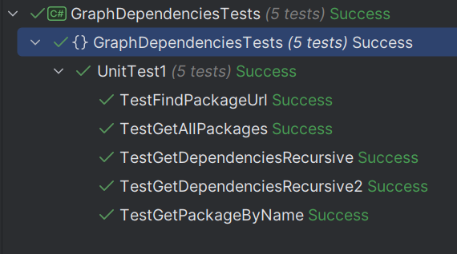

### Общее описание работы
Разработать инструмент командной строки для визуализации графа зависимостей, включая транзитивные зависимости

### Используемые модули и язык программирования
Использую язык программирования C# версии net8.0<br>
<br>
В качестве пакетов, импортируемых в программу, использую:
1. HtmlAgilityPack - для парсинга html страниц
2. Mono.Options - для работы с аргументами командной строки
3. SixLabors.ImageSharp - для работы с изображениями (визуализация графа зависимостей в консоли)

### При запуске программы необходимо указать:
1. Путь к программе для формирования графов
2. Имя пакета, зависимости которого необходимо отобразить
3. Максимальную глубину вложенности зависимостей
4. URL-адрес репозитория

### Пример запуска программы:
```
.\GraphDependencies.exe -p Graphviz-12.2.0-win64\bin\dot.exe -n erlang-asn1 -d -1 -u http://archive.ubuntu.com/ubuntu/ubuntu/dists/noble/main/
```
_И результат запуска примера:_
<br>

### Описание команд, функционирование программы
Пользователь вводит в консоль команду с аргументами, которые обрабатываются в программе. В случае некорректных данных, программа выдаёт сообщение об ошибке и завершает работу.<br> 
В случае корректных данных, программа выполняет следующие действия:<br>
_Сам процесс был разделён на несколько этапов._
1. Проверка аргументов командной строки
2. Получение url адреса архива пакетов по переданному url адресу репозитория
3. Получение из архива пакетов файла, а затем преобразования его в лист пакетов с именами и зависимостями
4. Поиск старого пакета в листе пакетов
5. Построение текста для генерации графа зависимостей пакета с учётом вложенных зависимостей
6. Генерация графа зависимостей пакета
7. Преобразование картинки графа зависимостей пакета в текст
8. Вывод графа зависимостей пакета в консоль

Все функции также обрабатывают случаи, когда аргументы некорректны. Все временно созданные файлы в конце выполнения программы удаляются.
### Тесты
Тестирование было выполнено в отельном проекте с использованием системы тестирования xUnit. На каждую функцию представлено минимум три теста.<br>
<br>
_Все они пройдены успешно._

### Url репозитория
[Домашнее задание размещено на github](https://github.com/Stranik2504/LabConfig/tree/lab2)